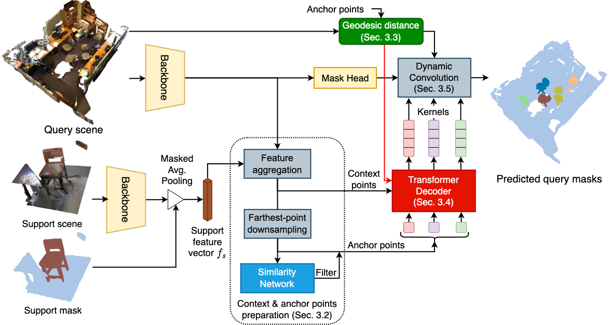

##### Table of contents
1. [Installation](#GInstallation)
2. [Data Preparation](#Data-Preparation)
3. [Training and Testing](#Training-and-Testing) 
4. [Quick Demo](#Quick-Demo)
5. [Acknowledgments](#Acknowledgments)
6. [Contacts](#Contacts)

# Geodesic-Former: a Geodesic-Guided Few-shot 3D Point Cloud Instance Segmenter
> **Abstract**: 
This paper introduces a new problem in 3D point cloud: few-shot instance segmentation. Given a few annotated point clouds characterizing a target class, our goal is to segment all instances of this target class in a query point cloud. This problem has a wide range of practical applications, especially in the areas where point-wise instance label segmentation annotation is prohibitively expensive to collect. To address this problem, we present Geodesic-Former – the first geodesic-guided transformer for 3D point cloud instance segmentation. The key idea is to leverage the geodesic distance to tackle the density imbalance of LiDAR 3D point clouds. The LiDAR 3D point clouds are dense near object surface and sparse or empty elsewhere making the Euclidean distance less effective to distinguish different objects. The geodesic distance, on the other hand, is more suitable since it encodes the object’s geometry which can be used as a guiding signal for the attention mechanism in a transformer decoder to generate kernels representing distinguishing features of instances. These kernels are then used in a dynamic convolution to obtain the final instance masks. To evaluate Geodesic-Former on the new task, we propose new datasets adapted from the two common 3D point cloud instance segmentation datasets: ScannetV2 and S3DIS. Geodesic-Former consistently outperforms very strong baselines adapted from state-of-the-art 3D point cloud instance segmentation approaches with significant margins.



Details of the model architecture and experimental results can be found in [our paper](http://arxiv.org/abs/2207.10859):

```bibtext
@inproceedings{ngo2022geoformer,
 author={Tuan Ngo and Khoi Nguyen},
 booktitle={Proceedings of European Conference on Computer Vision (ECCV)},
 title={Geodesic-Former: a Geodesic-Guided Few-shot 3D Point Cloud Instance Segmenter},
 year= {2022}
}
```

**Please CITE** our paper whenever this repository is used to help produce published results or incorporated into other software.

## Installation
Please refer to [installation guide](docs/INSTALL.md).

## Data Preparation
Please refer to [data preparation](docs/DATA_PREPARATION.md).

## Training and Testing
Please refer to [training guide](docs/TRAIN.md).

## Quick Demo

We provided a quick inference on ScannetV2 dataset with our pretrained model ([GoogleDrive](https://drive.google.com/file/d/1HFr2F2YwtitbrblwtKknO5Vuo4xNswXG/view?usp=sharing))

```bash
python test_fs.py --config config/test_geoformer_fs_scannet.yaml --output_path results/test --resume pretrains/best_fs_geoformer_scannet_fold0.pth
```

## Acknowledgements
This repo is built upon [DyCo3D](https://github.com/aim-uofa/DyCo3D), [spconv](https://github.com/traveller59/spconv), [3DETR](https://github.com/facebookresearch/3detr). 

## Contacts
If you have any questions or suggestions about this repo, please feel free to contact me (ductuan.ngo99@gmail.com).